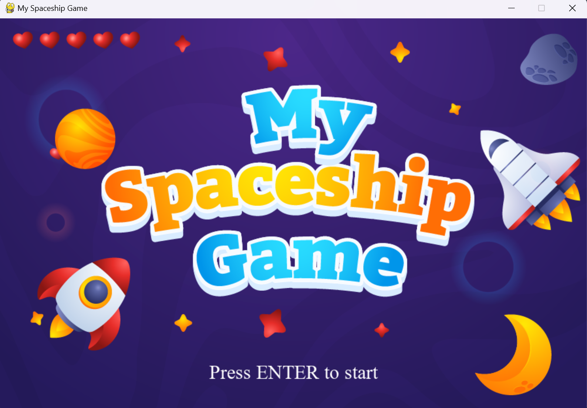
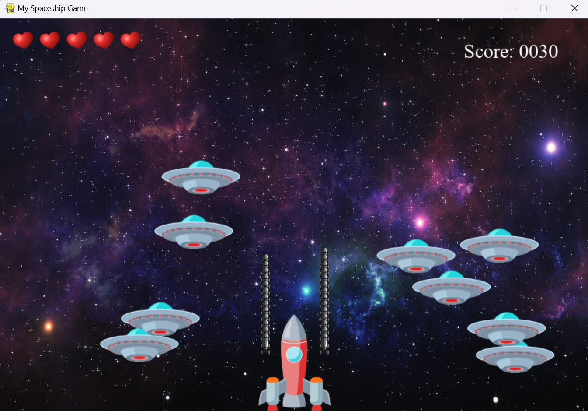
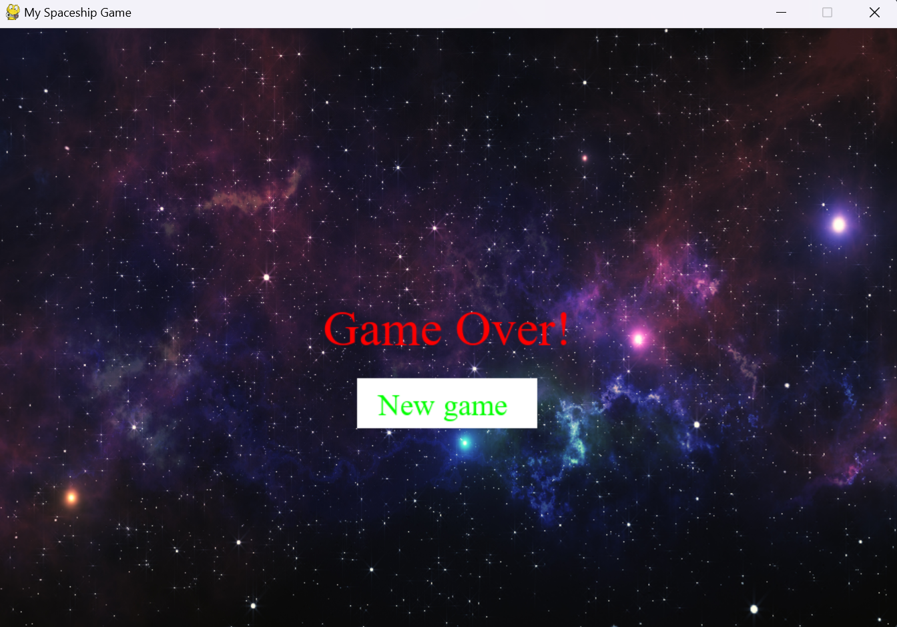

# Spaceship Game

This is a simple spaceship game developed in Python using the Pygame library.

## Description

This game allows you to control a spaceship and shoot down enemies that appear on the screen. The goal is to survive for as long as possible and accumulate the highest score.

## Features

- Simple keyboard controls for moving the spaceship and firing.
- Randomly generated enemies.
- Cumulative scoring for defeating enemies.
- Limited lives with graphical representation.
- Sound effects and background music.
- Start screen with an option to begin the game.

## Requirements

To run the game, you need to have Python installed on your system. Additionally, you must install the Pygame library using the following command:

    ```bash
    pip install pygame

## How to Play

- Use the arrow keys or the 'W', 'A', 'S', and 'D' keys to move the spaceship.
- Press the spacebar to fire at enemies.
- Survive for as long as possible and accumulate points by defeating enemies.
- Keep an eye on your lives, represented by hearts in the top left corner of the screen.
- Have fun!

## Screenshots





## Contributing
If you'd like to contribute to this project, we welcome pull requests! Feel free to improve the game, add new features, or fix bugs.

